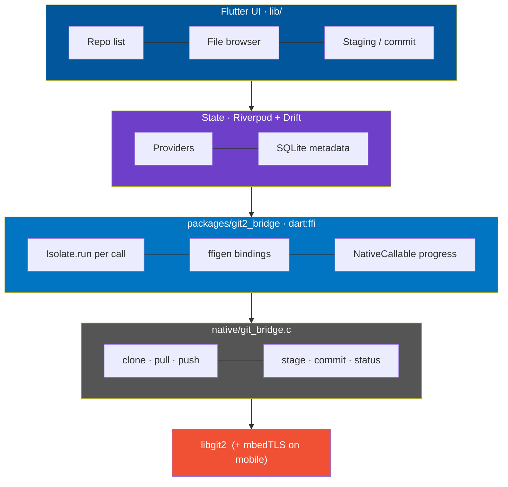

<div align="center">

# easy-svn

**A mobile Git client — Clone · Pull · Push · Stage · Commit — over HTTPS with GitHub OAuth2**

Flutter UI, [libgit2](https://libgit2.org/) engine, wired together over `dart:ffi`.


</div>

---

Built from an implementation plan calling for a solo-engineer-buildable MVP: no
subprocess spawning, no SSH, fast-forward-only pulls, and an offline-first
file browser. See `native/README.md` for the C bridge and
`packages/git2_bridge/README.md` for the FFI plugin that exposes it to Dart.

## Contents

- [Architecture](#architecture)
- [Repository layout](#repository-layout)
- [Verified vs. not verified in this environment](#verified-vs-not-verified-in-this-environment)
- [Setup](#setup)
  - [Linting](#linting)
  - [Tests](#tests)
  - [Native bridge tests](#native-bridge-tests-no-mobile-sdk-needed)
  - [GitHub OAuth App](#github-oauth-app)
  - [Android](#android)
  - [iOS](#ios)
- [Scope](#scope)

## Architecture



Every native call runs on a background `Isolate.run` — the UI isolate is
never blocked — and clone/pull/push stream real-time progress back across
the isolate boundary via `NativeCallable.listener`.

## Repository layout

| Path | What's there |
|---|---|
| `lib/` | The app: repo list (swipe to pull/push/delete), clone screen with progress, offline file browser, staging/commit screen, GitHub OAuth2 PKCE sign-in, Drift-backed repo metadata. |
| `native/` | `git_bridge.h` / `.c` — the flat C wrapper around libgit2 (clone / pull / push / stage / unstage / commit / status / file-tree / head-info). One canonical copy, compiled by both platform targets below. |
| `packages/git2_bridge/` | The Flutter FFI plugin: ffigen-generated bindings, the isolate-safe Dart API (`Git2Bridge`), Android CMake build, iOS podspec + xcframework build script. |
| `scripts/` | `native_smoke_test.sh` and `dart_ffi_smoke_test.sh` — validate the whole bridge (both layers) on a plain Linux/macOS machine, no phone or mobile SDK required. |

## Verified vs. not verified in this environment

> This was built in a sandboxed Linux container with **no Android SDK/NDK
> and no Xcode/macOS** — those are hard platform requirements for building
> the actual mobile binaries, not something any script can work around.

| Layer | Status |
|---|---|
| C bridge logic (clone/pull/push/stage/commit/status/tree) | ✔ **Verified.** `scripts/native_smoke_test.sh` runs all of it against real libgit2 and a real `file://` remote. |
| Dart FFI plumbing (struct marshaling, `Isolate.run`, cross-isolate progress via `NativeCallable.listener`) | ✔ **Verified.** `scripts/dart_ffi_smoke_test.sh` runs the actual `Git2Bridge` Dart API against a compiled `.so`. This caught and fixed two real bugs (a use-after-scope race on the progress struct, and a conflated error code for "unborn HEAD" vs. "repo not found") — see `native/README.md`. |
| Flutter app code (`lib/`) | ✔ `flutter analyze` clean under `very_good_analysis` (strict-casts/strict-inference/strict-raw-types + ~150 lint rules), 45 unit/widget tests pass, `dart format` applied. Not run in a simulator/emulator/device — none is available here. |
| `packages/git2_bridge` Dart layer | ✔ `flutter analyze` clean under the same lint set, 16 unit tests pass (error-code mapping, JSON model decoding). |
| Android build (`packages/git2_bridge/android/`) | ◐ Structurally validated: the same `native/CMakeLists.txt`, invoked with `-DGB_USE_SYSTEM_LIBGIT2=ON`, configures and links cleanly here. The `FetchContent`-vendored-libgit2 branch and the actual `.apk` build are **untested** — no NDK in this container. |
| iOS build (`packages/git2_bridge/ios/`) | ✘ **Not run.** `ios/Scripts/build_libgit2_xcframework.sh` needs a real Mac + Xcode; there is no way to test an iOS build anywhere else. |

Everything above the native/FFI boundary — the actual git engine and its
Dart interface — has been exercised end to end with real inputs, not just
written to compile. The remaining gap is entirely "run the standard Flutter
mobile build on a machine that has the mobile SDKs," which is expected setup
work, not unfinished logic.

## Setup

```sh
flutter pub get
dart run build_runner build --delete-conflicting-outputs   # Drift codegen
```

### Linting

`analysis_options.yaml` (app) and `packages/git2_bridge/analysis_options.yaml`
(package) both build on [`very_good_analysis`](https://pub.dev/packages/very_good_analysis)
— strict-casts, strict-inference, strict-raw-types, and ~150 additional lint
rules on top of `flutter_lints`. `public_member_api_docs` is on in
`packages/git2_bridge` (it's a real API surface) and off in the app
(internal screens/providers). A handful of purely stylistic rules
(`always_use_package_imports`, `cascade_invocations`, `sort_pub_dependencies`)
are turned off with inline rationale — everything else is enforced.

```sh
flutter analyze                              # app
(cd packages/git2_bridge && flutter analyze) # package
```

### Tests

```sh
flutter test                              # app: 45 tests
(cd packages/git2_bridge && flutter test) # package: 16 tests
```

<details>
<summary><strong>What's covered</strong></summary>
<br>

- PKCE generation (RFC 7636 shape, uniqueness)
- The full OAuth2 sign-in flow — happy path, CSRF state-mismatch rejection,
  GitHub error responses, non-200s, browser-launch failure — via an injected
  fake `http.Client` / deep-link stream / launcher, no real network or
  platform channels
- `repoNameFromUrl`
- The Drift schema against a real in-memory SQLite: `repos` CRUD,
  uniqueness constraint, reactive `watch()`, the `user_settings` singleton
  row
- `GbErrorCode` mapping and `GbStatusEntry` / `GbTreeEntry` / `GbHeadInfo`
  JSON decoding
- Widget tests for the clone screen (URL validation, sign-in banner states)
  and the staging/commit screen (stage/unstage, commit-disabled-when-nothing-
  staged, author-identity plumbing) — each isolated from native FFI and
  GitHub via a fake `RepoManager` rather than mocking `Git2Bridge` itself

</details>

### Native bridge tests (no mobile SDK needed)

```sh
sudo apt install libgit2-dev   # or: brew install libgit2
./scripts/native_smoke_test.sh
./scripts/dart_ffi_smoke_test.sh
```

### GitHub OAuth App

1. Go to <https://github.com/settings/developers> → **OAuth Apps** →
   **New OAuth App**.
2. Set the **Authorization callback URL** to exactly:
   ```
   gitclient://oauth/callback
   ```
3. Copy the **Client ID**, then click **Generate a new client secret** and
   copy that too (shown once).
4. Run with both:
   ```sh
   flutter run \
     --dart-define=GITHUB_CLIENT_ID=your_client_id \
     --dart-define=GITHUB_CLIENT_SECRET=your_client_secret
   ```

> **Note** (see `lib/features/auth/github_oauth_service.dart`): GitHub's
> classic OAuth Apps require a client *secret* for the token exchange even
> with PKCE, which means it ends up embedded in the compiled app binary.
> That's a GitHub-imposed constraint on mobile OAuth App clients, not
> something fixable app-side — a production-hardened version would exchange
> the code via a thin backend proxy instead of shipping the secret
> client-side.

### Android

Needs the Android NDK (version pinned via `flutter.ndkVersion`, see
`android/local.properties` / Android Studio SDK Manager). Once installed:

```sh
flutter build apk
```

The first build will `FetchContent`-clone and compile libgit2 + mbedTLS
(`native/CMakeLists.txt`) — expect it to take a while and need network
access; subsequent builds are cached by CMake/Gradle.

### iOS

Needs a Mac with Xcode. One-time setup:

```sh
cd packages/git2_bridge/ios
./Scripts/build_libgit2_xcframework.sh
cd ../../../ios && pod install
```

Then `flutter build ios` / `flutter run` as usual.

## Scope

| In | Out |
|---|---|
| HTTPS clone / pull / push | SSH authentication |
| Fast-forward-only pull | Merge / rebase conflict resolution |
| Stage, unstage, commit authoring | Submodules |
| Offline file tree browsing | Git hooks |
| GitHub OAuth2 (PKCE) | In-app file editing — use an external editor; the staging screen re-reads `git status` on refresh |
